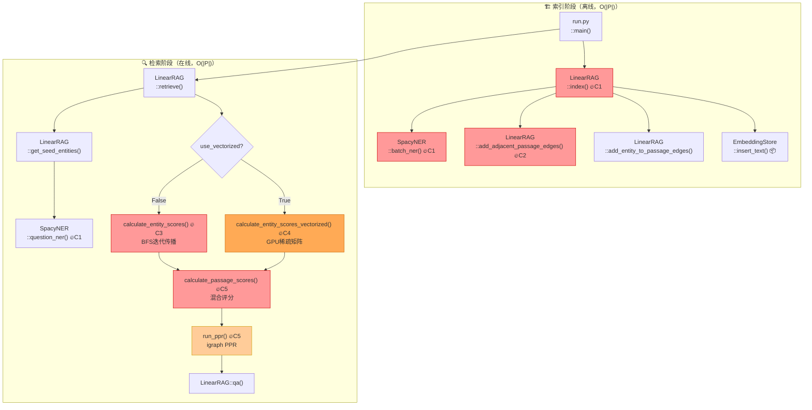
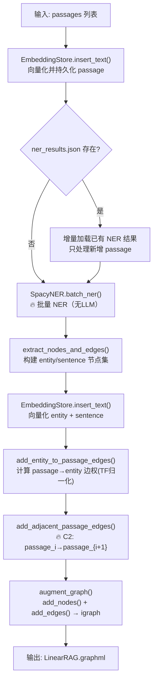
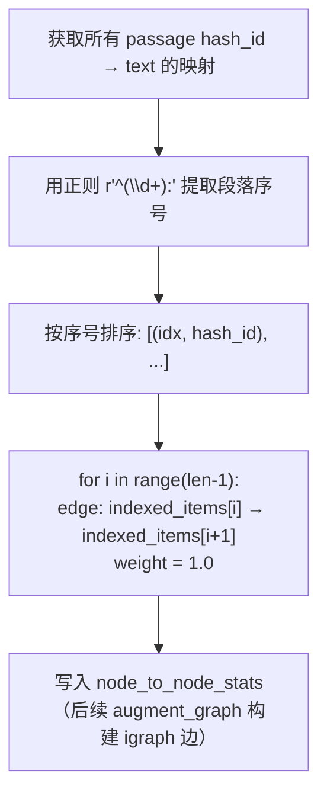
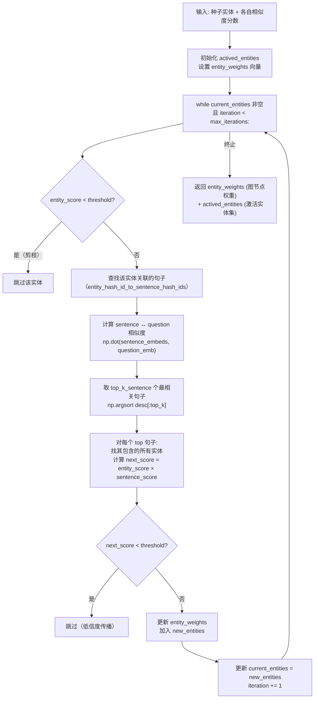
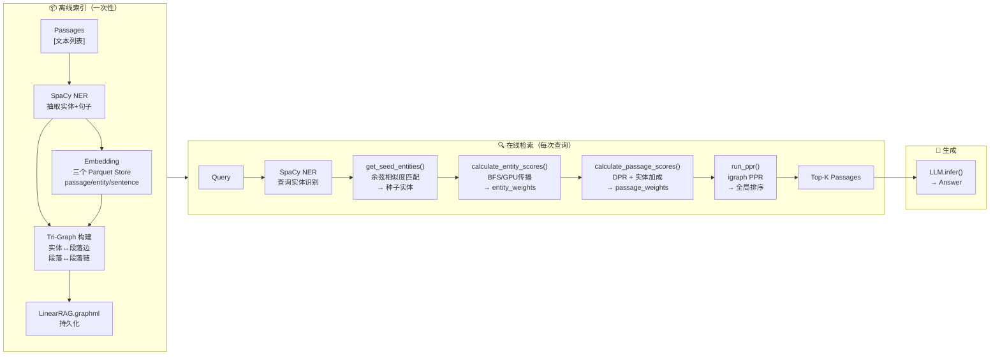

# 代码分析：LinearRAG

> **论文**：[LinearRAG: Linear Graph Retrieval Augmented Generation on Large-scale Corpora](https://arxiv.org/abs/2510.10114) | ICLR 2026  
> **GitHub**：[https://github.com/DEEP-PolyU/LinearRAG](https://github.com/DEEP-PolyU/LinearRAG)  
> **分析时间**：2026-04-16  
> **核心创新点数量**：5 条  
> **Repo 规模等级**：🟢 Nano（6个核心 Python 文件，~1078行）

---

## 论文-代码创新点映射总表

| ID | 论文声称的创新 | 对应代码位置 | 定位置信度 |
|----|-------------|-------------|----------|
| C1 | **Relation-free Tri-Graph 构建**：用 NER + 语义链接取代 LLM 关系抽取，索引时零 token 消耗，速度提升 77% | `LinearRAG.index()` + `SpacyNER.batch_ner()` | ⭐⭐⭐⭐⭐ |
| C2 | **线性链式结构**：相邻段落 passage_i → passage_{i+1} 构成有序链，使图复杂度 O(|P|) | `LinearRAG.add_adjacent_passage_edges()` | ⭐⭐⭐⭐⭐ |
| C3 | **BFS 实体分数传播**（语义桥接）：从种子实体出发，经句子节点迭代激活邻居实体，形成局部语义扩散 | `LinearRAG.calculate_entity_scores()` | ⭐⭐⭐⭐⭐ |
| C4 | **稀疏矩阵 GPU 向量化**：用 PyTorch `sparse_coo_tensor` 将 BFS 循环替换为矩阵乘法，保持等价语义 | `LinearRAG.calculate_entity_scores_vectorized()` + `_precompute_sparse_matrices()` | ⭐⭐⭐⭐⭐ |
| C5 | **混合通道段落评分**：DPR 相似度 × 实体加成 + log 平滑，再以 PPR 做全局重要性聚合 | `LinearRAG.calculate_passage_scores()` + `LinearRAG.run_ppr()` | ⭐⭐⭐⭐ |

> **一句话总结**：读懂这 5 个函数 = 读懂这篇论文 85% 的技术贡献。其他文件均为 boilerplate（存储层、配置、评估）。

---

## L1：架构鸟瞰

### 论文总体任务

> 在大规模语料上，用**不依赖 LLM 关系抽取**的层次图构建方式（Tri-Graph）替代现有 GraphRAG，实现**线性复杂度**的图检索增强生成。

### 文件结构（创新 vs 套路）

```
LinearRAG/
├── run.py                      ⚙️  [BOILERPLATE] 入口：argparse + 数据集加载 + 调 index/qa
└── src/
    ├── LinearRAG.py            🔥 [CORE] 全部 5 条创新均在此（673行）
    │   ├── index()             → C1 图构建主流程
    │   ├── add_adjacent_passage_edges()  → C2 线性链
    │   ├── calculate_entity_scores()     → C3 BFS 传播
    │   ├── calculate_entity_scores_vectorized() → C4 GPU向量化
    │   ├── calculate_passage_scores()    → C5 混合评分
    │   ├── run_ppr()           → C5 全局 PPR 重排序
    │   └── get_seed_entities() → 查询入口（辅助核心）
    ├── ner.py                  🔥 [CORE] SpaCy NER 封装（C1 的关键组件，48行）
    │   ├── batch_ner()         → 批量实体抽取（无 LLM）
    │   └── question_ner()      → 查询时实体识别
    ├── embedding_store.py      📦 [INFRA] Parquet 向量存储（MD5 hash ID 索引）
    ├── config.py               📦 [INFRA] LinearRAGConfig 数据类（超参数）
    ├── utils.py                ⚙️  [BOILERPLATE] LLM 封装 / 日志 / 归一化
    └── evaluate.py             ⚙️  [BOILERPLATE] 评估指标（F1、EM、recall）

图例：🔥 论文核心创新  |  📦 基础设施（非创新但必要）  |  ⚙️ 套路代码
```

### 核心依赖

| 库 | 版本 | 用途 | 是否与论文创新相关 |
|----|------|------|----------------|
| `spacy` | 3.x | NER 实体抽取（C1） | ✅ 是（取代 LLM 关系抽取的核心替换） |
| `igraph` | 0.11.x | PPR 全局排序（C5） | ✅ 是（`personalized_pagerank` 直接调用） |
| `torch` | 2.x | 稀疏矩阵 GPU 加速（C4） | ✅ 是（sparse_coo_tensor） |
| `sentence-transformers` | 2.x | 文本向量化 | 否（工具层） |
| `pandas` / `pyarrow` | 任意 | Parquet 持久化 | 否（存储层） |
| `numpy` | 任意 | 相似度矩阵计算 | 部分（辅助C3/C5） |

---

## L2：调用图（创新函数链）



---

## L3 + L4：核心创新函数深度分析

---

### [C1] `LinearRAG.index()` + `SpacyNER.batch_ner()` — 论文 Section 3.1

**论文原文**：
> *"LinearRAG constructs a relation-free hierarchical graph, termed Tri-Graph, using only lightweight entity extraction and semantic linking, avoiding unstable relation modeling… This new paradigm of graph construction scales linearly with corpus size and incurs no extra token consumption."*

**函数职责**：构建 Tri-Graph —— 三类节点（entity / sentence / passage）+ 两类边（含有关系、相邻关系），**全程不调用 LLM**。

**算法流程图**：



**任务-代码对照表（`index()` 核心路径）**：

| 代码行 | 解决的子问题 | 为什么这样写（反事实分析） | 论文出处 |
|--------|------------|-------------------------|---------|
| `self.spacy_ner.batch_ner(new_hash_id_to_passage, max_workers)` | 从段落中抽取实体（不调 LLM） | 若用 LLM 关系抽取（如 GraphRAG），每段需要 1~5 次 API 调用，成本 77% 更高；SpaCy 是 O(n) CPU 计算 | Section 3.1: "relation-free… using only lightweight entity extraction" |
| `load_existing_data()` → 增量处理 | 避免重复 NER | 大语料库（>10万段落）NER 是瓶颈；增量设计使再运行不重复计算 | 工程实现，未在论文中明确 |
| `add_entity_to_passage_edges()` 中 `score = count / passage_to_all_score[passage_hash_id]` | passage→entity 边权 = TF 归一化计数 | 原始计数对长段落有偏差；TF 归一化让短段落中的实体权重不被压制 | Section 3.1: "Contain matrix C" |

**`SpacyNER.batch_ner()` 关键设计**：

| 代码 | 设计意图 | 论文对应 |
|------|---------|---------|
| `self.spacy_model.pipe(passage_list, batch_size=...)` | 流式批量处理，内存效率高 | "lightweight entity extraction" |
| `if ent.label_ == "ORDINAL" or ent.label_ == "CARDINAL": continue` | 过滤数字序数词（噪音） | 提升图的语义质量 |
| `sentence_to_entities[sent_text].append(ent_text)` | 记录实体所在句子（用于 Mention Matrix M） | Section 3.1: 三类节点中 sentence 层 |

---

### [C2] `LinearRAG.add_adjacent_passage_edges()` — 论文 Section 3.1（"Linear" 的来源）

**论文原文**：
> *"This new paradigm of graph construction scales linearly with corpus size… O(|P|·T) time and memory complexity."*

**函数职责**：为按序号排列的段落建立 i → i+1 的有序链，这是 "Linear" 命名的核心由来——图是一条链而非全连接。

**算法流程图**：



**任务-代码对照表**：

| 代码行 | 解决的子问题 | 为什么这样写 | 论文出处 |
|--------|------------|-------------|---------|
| `index_pattern = re.compile(r'^(\d+):')` | 从段落文本头提取排列序号 | 数据格式约定：段落以 `"1: text..."` 形式存储；用正则而非外部元数据，自洽性强 | 工程设计 |
| `self.node_to_node_stats[current_node][next_node] = 1.0` | 相邻段落权重固定为 1.0 | 相邻段落通常在主题上连续；均匀权重避免了对主题相似度的额外估算，保持 O(|P|) 复杂度 | Section 3.1: "linear scaling" |
| 只连接 i→i+1（不是全连接或 k-NN） | 这就是 **linear**（线性链）的字面含义 | 全连接图 O(|P|²)；k-NN 需要相似度计算；顺序链 O(|P|) 且语义上合理（相邻段落共享上下文） | Section 3.1: Figure 1（LinearRAG vs GraphRAG 对比图） |

---

### [C3] `LinearRAG.calculate_entity_scores()` — 论文 Section 3.2.1

**论文原文**：
> *"Relevant Entity Activation via Semantic Bridging… local semantic bridging for precise entity activation… weighted aggregation of their associated neighbors through iterative updates."*

**函数职责**：从种子实体出发，通过"实体→句子→实体"的 BFS 迭代，激活语义相关的周边实体，为 PPR 提供局部先验权重。

**算法流程图**：



**任务-代码对照表**：

| 代码行 | 解决的子问题 | 为什么这样写 | 论文出处 |
|--------|------------|-------------|---------|
| `sentence_similarities = np.dot(sentence_embeddings, question_emb).flatten()` | 句子与问题的相关度评分 | 用余弦相似度（已 normalize）做桥接，比 BM25 泛化能力强；比调 LLM 成本低 4 个数量级 | Section 3.2.1: "query-sentence relevance" |
| `top_sentence_indices = np.argsort(...)[::-1][:self.config.top_k_sentence]` | 每个实体只走 top_k 条路径 | 控制传播宽度，防止稠密图中路径爆炸（类比 beam search 的 beam_width） | Section 3.2.1 |
| `next_entity_score = entity_score * top_sentence_score` | 传播分数衰减 | 乘法衰减确保多跳后分数收敛（几何级数）；加法则无法阻止无限传播 | Section 3.2.1: "weighted aggregation" |
| `if entity_score < self.config.iteration_threshold: continue` | 低分实体剪枝 | 避免"分数噪音"扩散到无关实体，保持激活集的精确性 | 工程实现 |
| `used_sentence_hash_ids.add(top_sentence_hash_id)` | 防止同一句子被多次使用 | 若不去重，同一句子会被多个实体"激活"，对其包含的实体造成重复加分 | 工程实现（论文未明确） |

---

### [C4] `LinearRAG.calculate_entity_scores_vectorized()` + `_precompute_sparse_matrices()` — GPU 加速

**论文原文**：
> *"Retrieval: O(|P|) computational complexity using sparse matrix operations."*

**函数职责**：将 C3 的 BFS Python 循环重写为 GPU 稀疏矩阵乘法，在大规模语料上实现同等语义的批量加速。

**核心数据结构**：

```
稀疏矩阵设计（COO格式）：
  E2S: entity_to_sentence_sparse  shape=(num_entities, num_sentences)   ← Mention Matrix M
  S2E: sentence_to_entity_sparse  shape=(num_sentences, num_entities)   ← Mention Matrix Mᵀ

每轮迭代的矩阵计算路径：
  实体分数向量 e (稀疏) → E2S.T @ e → 句子激活分数 s → top-k 选择 + dedup → 
  加权 s' → S2E.T @ s' → 下一轮实体分数 e'
```

**任务-代码对照表**：

| 代码段 | 解决的子问题 | 为什么这样写 | 等价 BFS 操作 |
|--------|------------|-------------|-------------|
| `torch.sparse_coo_tensor(e2s_indices, e2s_values, ...)` | 构建 Mention Matrix（稀疏） | 图是稀疏的（每实体连几个句子），COO 格式存储比密集矩阵节省 99%+ 空间 | `entity_hash_id_to_sentence_hash_ids` 字典 |
| `sentence_similarities_np = np.dot(self.sentence_embeddings, question_emb)` | **一次性**计算所有句子相似度 | BFS 版本每个实体都重算句子相似度；向量化版提前计算全部，避免重复 | 循环内的 `np.dot(sentence_embeddings, question_emb)` |
| `torch.sparse.mm(entity_to_sentence_sparse.t(), current_scores_2d)` | 实体分数 → 句子激活分数 | 等价于 BFS 的"遍历实体的邻居句子"，但批量完成 | `sentence_hash_ids = entity_hash_id_to_sentence_hash_ids[entity_hash_id]` |
| `used_sentence_mask[unique_selected_sentences] = True` | 句子去重（与 BFS 行为等价） | 向量化版本的"行为正确性"关键：确保结果与 BFS 一致 | `used_sentence_hash_ids.add(...)` |
| `torch.sparse.mm(sentence_to_entity_sparse.t(), weighted_scores_2d)` | 句子激活分数 → 下轮实体分数 | 等价于"从句子反查实体"的 BFS 内层循环 | `sentence_hash_id_to_entity_hash_ids[top_sentence_hash_id]` |

**两种实现的 trade-off**：

| 维度 | BFS 版（C3）| 向量化版（C4）|
|------|------------|-------------|
| 硬件要求 | CPU 即可 | 需要 GPU（无 CUDA 自动降级到 CPU）|
| 语料规模适用 | <5万段落 | 10万+ 段落 |
| 代码可读性 | ✅ 清晰，与论文描述直接对应 | ⚠️ 复杂，需要理解稀疏矩阵语义 |
| 语义等价性 | 基准 | 通过 `used_sentence_mask` 保证一致 |

---

### [C5] `LinearRAG.calculate_passage_scores()` + `LinearRAG.run_ppr()` — 论文 Section 3.2.2

**论文原文**：
> *"Passage Retrieval via Global Importance Aggregation… Personalized PageRank on entity-passage subgraph with hybrid initialization combining similarity between passage and query plus entity-level importance signals."*

**函数职责**：
- `calculate_passage_scores()`：计算段落的**局部混合分数**（DPR 相似度 + 实体加成）
- `run_ppr()`：将混合分数作为 PPR 个性化重置概率，在 Tri-Graph 上做**全局重排序**

**`calculate_passage_scores()` 评分公式解析**：

```python
# 每个段落的最终分数（论文 Eq. 中的 hybrid initialization）
passage_score = config.passage_ratio × DPR_score + log(1 + entity_bonus)

# entity_bonus 的计算（对所有激活实体求和）
entity_bonus += entity_score × log(1 + entity_occurrences_in_passage) / tier
```

| 分量 | 含义 | 设计原理 |
|------|------|---------|
| `passage_ratio × DPR_score` | 向量检索基础分（min-max 归一化） | 确保无实体匹配时仍有合理排序；`passage_ratio=2` 控制 DPR 权重 |
| `log(1 + entity_bonus)` | 实体激活加成（对数平滑） | log 防止实体密集段落（如目录页）过度加分；不用 linear 是为了平衡 |
| `entity_score × log(1 + count) / tier` | 实体出现次数 × 传播层次折扣 | `tier` 越大（多跳激活）折扣越大，防止远程传播的低质实体主导排序 |

**`run_ppr()` 全局聚合**：

| 代码行 | 含义 | 设计原理 |
|--------|------|---------|
| `reset_prob = np.where(node_weights > 0, node_weights, 0)` | 将混合分数作为 PPR 重置概率 | 个性化 PPR 的"个性化"来自此处：不同查询 → 不同重置分布 |
| `igraph.personalized_pagerank(..., damping=0.5, implementation='prpack')` | 在 Tri-Graph 上迭代扩散分数 | damping=0.5（平衡局部先验 vs 全局结构）；prpack 是 igraph 最快的 PPR 实现 |
| `doc_scores = [pagerank_scores[idx] for idx in passage_node_indices]` | 只取段落节点的 PPR 分数 | 实体/句子节点只参与传播，不参与最终排序 |

---

## 完整数据流（索引 → 检索 → 生成）



---

## 套路代码清单（已跳过深度分析）

> 以下为标准基础设施代码，非论文创新内容，仅列出供参考：

| 文件 / 函数 | 分类 | 说明 |
|------------|------|------|
| `run.py::main()` | BOILERPLATE | argparse 入口，调 index() + qa()，无创新逻辑 |
| `utils.py::LLM_Model` | BOILERPLATE | OpenAI API 封装，标准 wrapper |
| `utils.py::normalize_answer()` | BOILERPLATE | 标准 NLP 评估预处理（lowercase + 去标点） |
| `utils.py::setup_logging()` | BOILERPLATE | 标准日志配置 |
| `utils.py::min_max_normalize()` | BOILERPLATE | numpy 归一化，3行工具函数 |
| `embedding_store.py::EmbeddingStore` | INFRA | Parquet 向量存储，可替换为 FAISS/Milvus |
| `evaluate.py` | BOILERPLATE | F1/EM/recall 评估，标准实现 |
| `config.py::LinearRAGConfig` | INFRA | 超参数 dataclass，非算法 |

---

## 建议的代码阅读顺序

> 如果你要从零开始读懂这个 repo：

1. **先读论文 Abstract + Figure 1**（5分钟）：理解"Tri-Graph"是什么，与 GraphRAG 的核心区别
2. **打开 `src/config.py`**，浏览超参数：`damping=0.5`, `max_iterations=3`, `top_k_sentence=3`，记住这些数字
3. **读 `src/ner.py::SpacyNER`**（48行）：理解实体抽取的输入输出格式（passage → entity set + sentence→entity mapping）
4. **读 `src/LinearRAG.py::index()`**（L555起）：跟着注释看三类节点如何被构建进图中
5. **重点读 `add_adjacent_passage_edges()`**（L584起）：理解"Linear"命名的由来，这是最短的核心函数（15行）
6. **读 `calculate_entity_scores()`**（L218起）：BFS 传播逻辑，结合 L4 对照表逐行理解
7. **最后读 `calculate_passage_scores()` + `run_ppr()`**：理解局部分数如何被 PPR 全局聚合
8. 如有 GPU 优化需求：再读 `calculate_entity_scores_vectorized()`（与 C3 对比阅读）

---

## 延伸问题（结合 ARIS-mNGS 科研方向）

- [ ] **迁移可行性**：LinearRAG 的 Tri-Graph 能否用于 mNGS 报告的结构化检索？段落="病原体描述段"，实体="菌名/基因名"，链式结构="诊断流程顺序"
- [ ] **BioASQ 应用**：SpaCy NER 在生物医学文本上表现如何？是否需要换用 `en_core_sci_sm` 或 `SciSpaCy` 模型？（LinearRAG 论文用的是通用 SpaCy 模型）
- [ ] **GraphRAG vs LinearRAG 的本质取舍**：LinearRAG 牺牲了"关系类型"（is-a, causes-a 等），换来了 O(|P|) 复杂度 —— 在 mNGS 场景下，关系类型对诊断精度有多重要？
- [ ] **PPR 参数敏感性**：`damping=0.5` 是论文调参结果还是经验值？在医疗知识图谱上可能需要不同取值（医学实体间的关联更长程，可能需要更低的 damping）
- [ ] **向量化版本的工程复用**：`_precompute_sparse_matrices()` 中的 E2S/S2E 矩阵预计算模式，可否直接移植到 ARIS 项目的实体-段落检索模块？

---

## 参考对比

| 系统 | 图构建方式 | 关系抽取 | 索引复杂度 | 检索方式 |
|------|----------|---------|-----------|---------|
| **Microsoft GraphRAG** | 实体 + 关系 + 社区 | LLM 关系抽取（昂贵） | O(|P|·|E|·LLM) | 全局/局部双路 |
| **HippoRAG** | KG + PPR | LLM 三元组抽取 | O(|P|·LLM) | PPR |
| **LinearRAG (本文)** | Tri-Graph（实体/句/段落） | SpaCy NER（无LLM） | O(|P|·T) | 实体传播 + PPR |
| **Vanilla RAG** | 无图 | 无 | O(|P|) | DPR 向量检索 |
