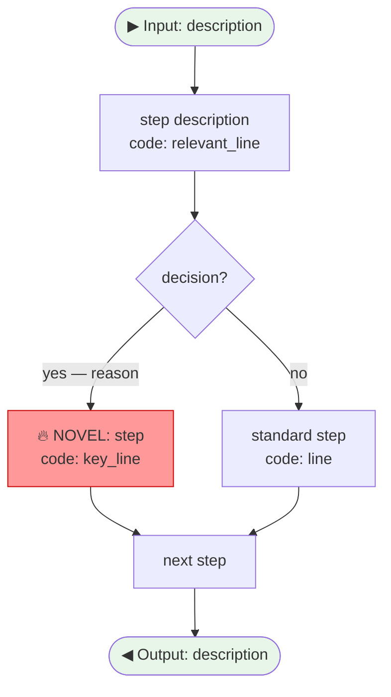

# Output Templates

Standard templates used across all RepoStrata skills for consistent output formatting.

---

## L3 — Algorithm Flowchart Template (Mermaid)

````markdown

````

Node conventions:
- `🔥` prefix + red fill (`#ff9999`) → paper's novel operation
- Normal fill → standard/infrastructure step
- Diamond `{}` → conditional branch
- Round `([])` → start/end

---

## L4 — Task-Code Mapping Table Template

```markdown
### `ClassName.method_name()` — [one-line description]

**Location**: `path/to/file.py`, lines X–Y  
**Paper reference**: Section Z.Z — *"[relevant quote from paper]"*

| Code | Sub-problem Solved | Why This Way (Counterfactual) | Paper Ref |
|------|--------------------|-------------------------------|-----------|
| `n = len(arr)` | Determine array boundary | Without pre-computing: repeated len() calls; needed for `n-i-1` expression | — |
| `for i in range(n)` | Control bubble-pass count | Worst case (fully reversed) needs n-1 passes; range(n) includes safe margin | — |
| `range(0, n-i-1)` | Skip already-sorted tail | Without `-i`: redundant comparisons; after pass i, last i elements are final | Sec 3.1 |
| `if arr[j] > arr[j+1]` | Detect adjacent inversion | `>=` would swap equal elements, breaking stability guarantee | — |
| `a, b = b, a` | In-place swap without temp var | Python tuple assignment; functionally identical to tmp-var swap but idiomatic | — |
```

---

## Innovation Mapping Table Template

```markdown
## 📋 Paper ↔ Code Innovation Mapping

> Reading these N functions = understanding 80% of the paper's technical contribution.

| ID | Paper Claim | Code Location | File | Confidence |
|----|-------------|---------------|------|-----------|
| C1 | [claim text, max 60 chars] | `ClassName.method()` | `path/file.py` | ⭐⭐⭐⭐⭐ |
| C2 | ... | ... | ... | ⭐⭐⭐⭐ |
```

---

## File Tree Template (L1)

```
[repo-name]/
  [file].py          → 🔥 [CORE] [one-line role] ([claim IDs if applicable])
  [dir]/
    [file].py        → 📦 [INFRA] [one-line role]
    [file].py        → ⚙️  [BOILERPLATE] [one-line role]
  [file].py          → ⚙️  [BOILERPLATE] [one-line role]

Legend: 🔥 Novel contribution  📦 Infrastructure  ⚙️ Boilerplate (skipped)
```

---

## Follow-up Questions Template

```markdown
## ❓ Follow-up Questions

- [ ] How does [novel mechanism] compare to [related prior work]?
- [ ] Can [specific design decision in C1] transfer to your [ARIS / RAG / KG] project?
- [ ] What would break if you replaced [key component] with a simpler alternative?
- [ ] Which parts of this codebase are safe to use as-is vs. need adaptation for your domain?
```
