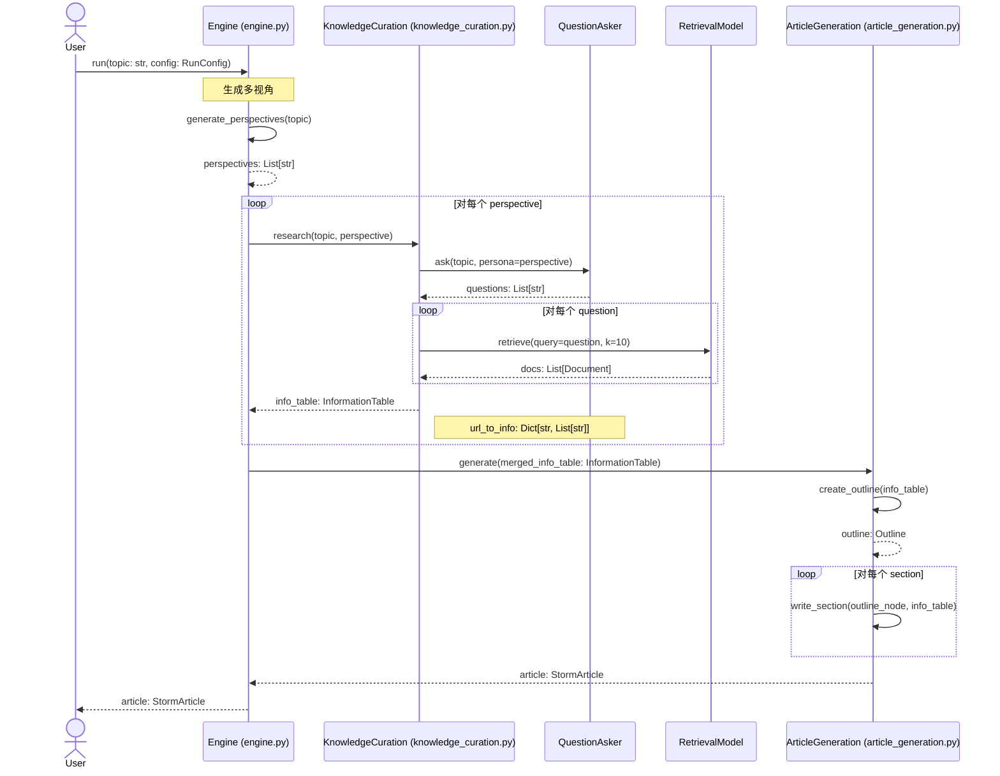
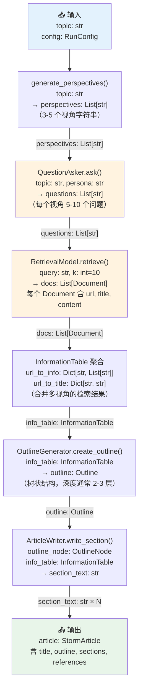

# /data-flow — 数据流转全链路可视化

**定位**：追踪数据从原始输入到最终输出，在每个函数/模块间如何流动、转换、变形。

**回答的问题**：
- "一个用户输入的 `topic: str`，经过哪几次变换，变成了最后的 `StormArticle`？"
- "这里的 `Tensor[B, L, D]` 到底是在哪一步被 reshape 成 `Tensor[B, D]` 的？"
- "中间某步的输出格式是什么，为什么下一步能接收它？"

---

## VAULT PATH MAPPING

- 输出：`03.资料库/代码分析/[repo名]-data-flow.md`

---

## 调用格式

```
# 从入口函数开始，自动追踪整个流程
/data-flow https://github.com/user/repo --entry engine.py::run

# 指定起点和终点（只追踪这条路径）
/data-flow https://github.com/user/repo --from loader.py::load --to model.py::predict

# 聚焦某种数据类型的流转（追踪 InformationTable 从哪里产生，到哪里消亡）
/data-flow https://github.com/user/repo --trace-type InformationTable
```

---

## WORKFLOW

### Step 1：确定追踪起点

读取入口函数（`--entry` 指定，或从 `/inno-scan` 结果中取主函数）的签名：
- **输入参数**：类型 + 语义（从参数名 + docstring 推断）
- **输出类型**：return type annotation

### Step 2：AST 追踪数据变换链

```bash
python3 << 'EOF'
import ast, json, sys
from pathlib import Path

def trace_data_flow(entry_file, entry_func, repo_path):
    """
    从入口函数出发，递归追踪：
    1. 入口函数输入什么类型
    2. 调用了哪些子函数，传入什么，收到什么
    3. 对返回值做了什么变换
    4. 最终输出什么类型
    """
    
    def parse_file(fpath):
        with open(fpath) as f:
            return ast.parse(f.read())
    
    def find_func(tree, name):
        for node in ast.walk(tree):
            if isinstance(node, (ast.FunctionDef, ast.AsyncFunctionDef)):
                if node.name == name:
                    return node
        return None
    
    def get_signature(func_node):
        args = []
        for arg in func_node.args.args:
            if arg.arg == 'self': continue
            ann = ast.unparse(arg.annotation) if arg.annotation else 'Any'
            args.append({'name': arg.arg, 'type': ann})
        ret = ast.unparse(func_node.returns) if func_node.returns else 'Any'
        return {'args': args, 'return': ret}
    
    def extract_assignments(func_node):
        """提取函数内的变量赋值和类型变换"""
        transforms = []
        for node in ast.walk(func_node):
            # 赋值语句（可能发生类型/形状变换）
            if isinstance(node, ast.Assign):
                targets = [ast.unparse(t) for t in node.targets]
                value = ast.unparse(node.value)
                transforms.append({'target': targets, 'value': value})
            # 带类型注解的赋值
            if isinstance(node, ast.AnnAssign):
                transforms.append({
                    'target': [ast.unparse(node.target)],
                    'type': ast.unparse(node.annotation),
                    'value': ast.unparse(node.value) if node.value else None
                })
        return transforms
    
    # 主追踪逻辑
    entry_tree = parse_file(Path(repo_path) / entry_file)
    entry_node = find_func(entry_tree, entry_func)
    
    if not entry_node:
        return {'error': f'Function {entry_func} not found in {entry_file}'}
    
    sig = get_signature(entry_node)
    transforms = extract_assignments(entry_node)
    
    # 递归追踪调用链（最多 3 层）
    call_chain = []
    for node in ast.walk(entry_node):
        if isinstance(node, ast.Call):
            callee = ast.unparse(node.func)
            call_args = [ast.unparse(a) for a in node.args]
            call_chain.append({'callee': callee, 'args': call_args})
    
    return {
        'entry': {'file': entry_file, 'func': entry_func},
        'signature': sig,
        'transforms': transforms[:20],  # 限制数量
        'calls': call_chain
    }

result = trace_data_flow(sys.argv[1], sys.argv[2], sys.argv[3])
print(json.dumps(result, indent=2))
EOF
engine.py run /tmp/deepdecode-storm/
```

### Step 3：生成三种可视化

#### 图 A：Mermaid Sequence Diagram（模块间交互 + 数据类型）

````markdown

````

#### 图 B：数据变换流程图（形状/类型变化）

````markdown

````

#### 图 C：数据类型变换总表

```markdown
## 数据类型流转汇总

| 步骤 | 函数 | 输入类型 | 输出类型 | 发生了什么变换 |
|------|------|---------|---------|-------------|
| 1 | `generate_perspectives()` | `str` | `List[str]` | 字符串 → LLM 生成的视角列表 |
| 2 | `QuestionAsker.ask()` | `str, str` | `List[str]` | 主题+视角 → 问题列表 |
| 3 | `RM.retrieve()` | `str, int` | `List[Document]` | 问题字符串 → 检索文档列表 |
| 4 | `InformationTable` 聚合 | `List[Document] × N` | `InformationTable` | 多次检索结果 → 统一字典结构 |
| 5 | `create_outline()` | `InformationTable` | `Outline` | 扁平文档集 → 层次大纲 |
| 6 | `write_section()` × N | `OutlineNode, InformationTable` | `str` | 大纲节点 → 文章段落文本 |
| 7 | `StormArticle` 构建 | `str × N + Outline` | `StormArticle` | 各段落 → 完整文章对象 |
```

### Step 4：关键数据结构解剖

对每个流转过程中的核心中间数据类型，展示其内部结构：

```markdown
## 关键数据结构解剖

### InformationTable（最重要的中间结构）
```python
# 实际结构（从 storm_dataclass.py 提取）
@dataclass
class InformationTable:
    title: str
    url_to_info: Dict[str, List[str]]  # URL → 该页面的关键信息片段列表
    url_to_title: Dict[str, str]       # URL → 页面标题
    
    # 隐含约束（从使用方代码推断）：
    # - url_to_info 中每个 List[str] 通常有 3-10 个元素
    # - 每个元素是一段摘录（通常 100-500 字）
    # - 多个视角的结果会被 merge 到同一个 InformationTable
```

---

## OUTPUT FORMAT

```markdown
---
date: YYYY-MM-DD
repo: [URL]
entry: [file::function]
tags: [source/code-analysis]
skill: data-flow
---

# 🌊 Data Flow：[repo-name]

## Pipeline 全链路（Sequence Diagram）

[Mermaid sequenceDiagram，含每步传递的数据类型]

## 数据变换流程图

[Mermaid flowchart，含类型标注]

## 类型变换汇总表

[表格：步骤 × 输入类型 × 输出类型 × 变换说明]

## 关键中间数据结构

[每个核心中间类型的字段详情]
```

---

## 上下文预算

| 操作 | Token |
|------|-------|
| AST 流转追踪输出 | ~4,000 |
| Sequence Diagram 生成 | ~2,000 |
| Flowchart 生成 | ~1,500 |
| 类型变换表 | ~1,500 |
| **总计** | **~9,000** |
