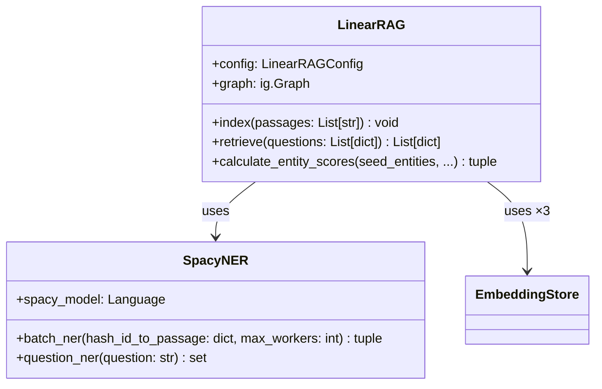

# /full-analysis — 全流程一键编排

**定位**：DeepDecode 的总指挥。一条命令启动完整分析 pipeline。  
内置**仓库规模评估**（原 preflight）和**结果合并**（原 merge-analysis），无需单独调用。

---

## VAULT PATH MAPPING

- 检查点目录：`03.资料库/代码分析/[repo名]/`
  - `01-architecture.md`：L1 文件树 + 职责摘要
  - `02-callgraph.md`：L2 调用图 + 接口契约（合并）
  - `03-dataflow.md`：数据流转图
  - `04-innoscan.md`：论文发现 + 创新点定位
  - `05-[funcname]-explain.md`：核心函数 L3+L4（每函数一文件）
  - `REPORT.md`：最终综合报告

---

## 调用格式

```
# 标准用法（推荐，自动搜索论文）
/full-analysis https://github.com/user/repo

# 指定论文（跳过搜索步骤）
/full-analysis https://github.com/user/repo --paper https://arxiv.org/abs/xxxx

# 用户本地 PDF（搜不到论文时上传）
/full-analysis https://github.com/user/repo --paper /path/to/paper.pdf

# 快速模式（架构 + 创新点，跳过 L3+L4 深度解析）
/full-analysis https://github.com/user/repo --mode quick

# 深度模式（全部 L3+L4，最完整）
/full-analysis https://github.com/user/repo --mode deep

# 断点续跑
/full-analysis https://github.com/user/repo --resume
```

---

## PIPELINE 总览

```
/full-analysis
│
├── Step 0: TRIAGE（内置，< 30 秒）
│   ├── 统计文件数 / 行数 → 分级（Nano/Small/Medium/Large/Huge）
│   ├── 确定执行策略（单批 or 分批）
│   └── 检查断点文件（--resume 时跳过已完成阶段）
│
├── Step 1: ARCHITECTURE（总是执行）
│   ├── 文件树 + 职责摘要（L1）          → 01-architecture.md
│   └── 调用图 + 接口契约（L2）          → 02-callgraph.md
│
├── Step 2: DATA FLOW（Standard/Deep 模式）
│   └── Pipeline 序列图 + 数据变换表    → 03-dataflow.md
│
├── Step 3: INNOVATION SCAN（总是执行）
│   ├── 论文自动发现（三级降级）
│   ├── 创新点 → 代码函数映射
│   └── Large/Huge：自动分批，完成后内联合并  → 04-innoscan.md
│
├── Step 4: DEEP DIVE（Deep 模式 / 用户确认）
│   └── 每个核心函数：L3 流程图 + L4 逐行对照表  → 05-[func]-explain.md
│
└── Step 5: SYNTHESIS（总是执行）
    └── 读取所有检查点，生成 REPORT.md
```

---

## WORKFLOW 详细步骤

### Step 0：Triage（内置规模评估）

```bash
# 克隆仓库（仅元数据，不下载 blob）
git clone --depth=1 --filter=blob:none \
  [REPO_URL] /tmp/deepdecode-[repo名]/

# 统计 Python 文件
find /tmp/deepdecode-[repo名]/ -name "*.py" \
  ! -path "*/__pycache__/*" ! -path "*/test*" \
  ! -path "*/example*" | wc -l

# 统计总行数
find /tmp/deepdecode-[repo名]/ -name "*.py" \
  ! -path "*/__pycache__/*" \
  | xargs wc -l | tail -1
```

**分级标准与策略**：

| 级别 | Python 文件数 | 总行数 | 策略 |
|------|------------|--------|------|
| 🟢 Nano | ≤ 15 | ≤ 2k | 全量读取，所有 Phase 单批完成 |
| 🔵 Small | 16–50 | 2k–10k | 全量读取，Phase 4 仅分析前 5 个创新函数 |
| 🟡 Medium | 51–200 | 10k–50k | Grep-only 模式，按模块分批 Phase 3-4 |
| 🟠 Large | 201–500 | 50k–150k | Phase 1 全量；Phase 3-4 只读创新文件 |
| 🔴 Huge | 500+ | 150k+ | Phase 1 仅文件树；Phase 3-4 纯关键词制导 |

**断点检查**（`--resume` 时执行）：
```
检查 03.资料库/代码分析/[repo名]/ 是否存在
若存在：列出已完成阶段 → 跳过，从未完成处继续
若不存在：创建目录，开始全新分析
```

---

### Step 1：Architecture

**1a. 文件树（L1）**

生成带职责标注的文件树，区分：
- 🔥 `[CORE]` — 根据文件名/结构推断的核心逻辑
- 📦 `[INFRA]` — 存储、配置、模型加载等基础设施
- ⚙️ `[BOILERPLATE]` — 训练循环、评估、日志、入口脚本

```
src/
  LinearRAG.py    🔥 [CORE] 主算法实现
  ner.py          🔥 [CORE] 实体抽取（无LLM）
  embedding_store.py  📦 [INFRA] 向量持久化
  config.py       📦 [INFRA] 超参数
  utils.py        ⚙️  [BOILERPLATE] LLM封装/日志
  evaluate.py     ⚙️  [BOILERPLATE] 评估指标
```

**1b. 调用图 + 接口契约（L2，合并）**

使用 Python AST 静态分析（`ast` 标准库，无需安装额外依赖）：

```python
# 提取信息：
# 1. 函数签名：名称、参数名、类型注解、返回类型、默认值
# 2. 调用关系：函数 A 内部调用了哪些函数
# 3. 接口定义：dataclass、ABC、Protocol、Pydantic BaseModel
```

输出 Mermaid classDiagram（同时体现继承关系和调用关系）：



---

### Step 2：Data Flow

以入口函数为起点，追踪数据从输入到输出的完整变换链：

- 生成 Mermaid Sequence Diagram（模块间交互时序）
- 生成数据变换表（每一跳的数据形状变化）

```
输入: passages: List[str]
  ↓ EmbeddingStore.insert_text()
  → hash_id → embedding (np.ndarray[768])
  ↓ SpacyNER.batch_ner()
  → {hash_id: [entity_str, ...], sentence: [entity_str, ...]}
  ↓ extract_nodes_and_edges()
  → entity_nodes: Set[str], sentence_nodes: Set[str]
  ↓ add_edges()
  → ig.Graph（三层节点 + 两类边）
```

---

### Step 3：Innovation Scan（含论文自动发现）

**论文发现（三级降级策略）**：

**级别 1：README 扫描**
```bash
# 从 README.md 中提取论文链接
grep -oP 'https?://arxiv\.org/(abs|pdf)/[\d\.]+|https?://aclanthology\.org/\S+|https?://openreview\.net/forum\?id=\S+' \
  /tmp/deepdecode-[repo名]/README.md | head -3
```

若找到 → 使用该 URL，跳至论文获取

**级别 2：WebSearch 搜索**（级别 1 失败时）
```
搜索查询（按优先级）：
1. site:arxiv.org "[repo名]"
2. "[repo名] [作者/组织名] arxiv paper"
3. "[repo名] ICLR OR NeurIPS OR ACL OR EMNLP 2024 OR 2025"
```

若找到可信的 arXiv 链接 → 使用，并告知用户"自动搜索到论文：[标题]"

**级别 3：用户提供 / 无论文**
- 用户已通过 `--paper` 提供 URL 或 PDF 路径 → 直接使用
- 用户提供 PDF 路径 → `Read` 工具读取
- 找不到任何论文 → **Code-Only 模式**（见下）

**论文获取格式**：
```
arXiv URL → 优先获取 HTML 版（内容更全）：
  https://arxiv.org/abs/2510.10114
  → 尝试: https://arxiv.org/html/2510.10114
  → 备用: WebFetch abstract 页面

ACL Anthology → 直接 WebFetch 论文页面
OpenReview → 直接 WebFetch（含 reviews）
本地 PDF → Read 工具直接读取
```

**Code-Only 模式**（无任何论文时）：
```
基于以下启发式识别"创新候选函数"：
1. 函数名中含有算法性词汇（calculate, compute, propagate, encode, rank, score）
2. 被多处调用（高入度）
3. 函数体非标准库调用（含自定义循环/矩阵操作/图操作）
4. 文件名不匹配 boilerplate 模式

所有映射标注置信度为"推断（无论文）"
```

**创新定位**（有论文时）：
1. 提取 Abstract + Contributions + Method 章节标题
2. 构建关键词列表（每条创新声明 3–7 个关键词）
3. Grep 搜索（仅非 boilerplate 文件）
4. 读取命中函数片段（每个 ~50 行）
5. 评分 → 建立论文-代码映射表

**Large/Huge 分批合并**：
```
按顶层模块分批：每批处理一个子目录
批次结果临时存储在内存（不写中间文件）
全部完成后 → 内联合并 → 写入 04-innoscan.md
```

---

### Step 4：Deep Dive（需用户确认）

```
发现 N 个核心函数，是否进行 L3+L4 深度解析？
预计额外消耗：~7k tokens × N 个函数
[Y/N/选择性（输入函数序号）]
```

对每个确认的函数：

**L3：算法流程图（Mermaid flowchart）**
- 🔥 节点：论文声称的创新操作
- `standard` 节点：标准库调用

**L4：逐行任务-代码对照表**

| 代码行/表达式 | 解决的子问题 | 为什么这样写（反事实） | 论文出处 |
|-------------|------------|---------------------|---------|
| `np.dot(sent_emb, q_emb)` | 计算句子-问题相关度 | 余弦相似度比 BM25 泛化好；比 LLM re-rank 快 4 个数量级 | Sec 3.2.1 |

---

### Step 5：Synthesis

读取所有检查点文件 → 生成 `REPORT.md`：

- 论文-代码映射总表（来自 Step 3）
- 架构关键洞察（来自 Step 1）
- 数据流关键节点（来自 Step 2）
- 建议阅读顺序（从哪个函数开始）
- 面向用户科研方向的延伸问题

---

## 模式对比

| 模式 | 执行步骤 | 适用场景 | 预计 token |
|------|---------|---------|-----------|
| `--mode quick` | 0 + 1 + 3 | 快速了解创新点 | ~25k |
| `--mode standard`（默认）| 0 + 1 + 2 + 3 + 5 | 平衡深度与效率 | ~50k |
| `--mode deep` | 全部 0–5 | 完全读懂，准备复现 | ~100k+ |

---

## 进度汇报节点

每个 Step 完成后输出一行汇报：
```
✅ Step 0 完成：LinearRAG — Nano 级（6文件/1078行），单批执行
✅ Step 1 完成：识别到 2 个🔥核心文件，4 个⚙️套路文件
✅ Step 2 完成：数据流 5 跳，关键变换节点在 calculate_entity_scores()
✅ Step 3 完成：自动找到论文 [LinearRAG ICLR'26]，定位 5 个创新函数
❓ Step 4：发现 5 个核心函数，是否进行深度 L3+L4 解析？[Y/n]
✅ Step 5 完成：报告已保存至 03.资料库/代码分析/LinearRAG/REPORT.md
```
