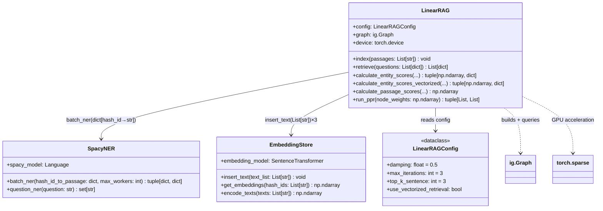

# /repo-callgraph — 调用图 + 接口契约（AST 静态分析）

**定位**：用 Python 标准库 `ast` 做静态分析，同时产出两种信息：
1. **调用图**：谁调用谁，传什么形状的数据（参数类型/维度）
2. **接口契约**：dataclass / Pydantic / ABC / Protocol 定义的数据模型

两者本质上是同一次 AST 扫描的两个视角，合并分析效率更高。

**技术基础**：Python `ast` 标准库（无需执行代码，无需额外依赖，任何环境可用）

---

## VAULT PATH MAPPING

- 输出：`03.资料库/代码分析/[repo名]-callgraph.md`

---

## 调用格式

```
# 分析整个 repo 的核心模块
/repo-callgraph https://github.com/user/repo

# 只分析指定文件（推荐：先跑 /inno-scan 确认文件）
/repo-callgraph https://github.com/user/repo --files engine.py,knowledge_curation.py

# 从入口函数出发，追踪 N 层调用（默认 3 层）
/repo-callgraph https://github.com/user/repo --entry main --depth 3
```

---

## WORKFLOW

### Step 1：克隆（仅目标文件）

```bash
git clone --depth=1 --filter=blob:none --sparse \
  [REPO_URL] /tmp/deepdecode-[repo名]/

# 检出目标 Python 文件
git -C /tmp/deepdecode-[repo名]/ sparse-checkout set \
  [file1.py] [file2.py] ...
git -C /tmp/deepdecode-[repo名]/ checkout
```

若未指定 `--files`，先获取文件树，过滤 boilerplate 后确定目标文件。

---

### Step 2：AST 解析脚本

```python
# 在 bash 中执行（无需额外依赖）
python3 - << 'EOF'
import ast, json, sys

def extract_info(filepath):
    with open(filepath) as f:
        tree = ast.parse(f.read())
    
    result = {
        "functions": [],
        "classes": [],
        "calls": [],          # 调用关系
        "interfaces": [],     # 数据契约（dataclass/ABC/Protocol/Pydantic）
    }
    
    for node in ast.walk(tree):
        # 提取函数签名
        if isinstance(node, ast.FunctionDef):
            func_info = {
                "name": node.name,
                "args": [(a.arg, ast.unparse(a.annotation) if a.annotation else None)
                         for a in node.args.args],
                "returns": ast.unparse(node.returns) if node.returns else None,
                "lineno": node.lineno,
                "calls": []
            }
            # 提取该函数内部的调用
            for child in ast.walk(node):
                if isinstance(child, ast.Call):
                    if isinstance(child.func, ast.Name):
                        func_info["calls"].append(child.func.id)
                    elif isinstance(child.func, ast.Attribute):
                        func_info["calls"].append(
                            f"{ast.unparse(child.func.value)}.{child.func.attr}"
                        )
            result["functions"].append(func_info)
        
        # 提取类（含接口识别）
        if isinstance(node, ast.ClassDef):
            bases = [ast.unparse(b) for b in node.bases]
            decorators = [ast.unparse(d) for d in node.decorator_list]
            
            interface_type = None
            if any("dataclass" in d for d in decorators):
                interface_type = "dataclass"
            elif any(b in ["BaseModel"] for b in bases):
                interface_type = "pydantic"
            elif any(b in ["ABC", "abc.ABC"] for b in bases):
                interface_type = "abstract"
            elif any(b in ["Protocol"] for b in bases):
                interface_type = "protocol"
            
            result["classes"].append({
                "name": node.name,
                "bases": bases,
                "interface_type": interface_type,
                "lineno": node.lineno
            })
    
    return result

# 对每个目标文件执行
for path in sys.argv[1:]:
    print(json.dumps({"file": path, **extract_info(path)}))
EOF
```

---

### Step 3：生成 Mermaid classDiagram

结合调用关系和接口定义，生成统一的类图：



---

### Step 4：参数形状追踪表

对核心函数间传递的数据，记录实际形状（非类型注解，而是运行时形状）：

| 调用链 | 传入数据 | 输出数据 | 形状约束 |
|--------|---------|---------|---------|
| `retrieve()` → `calculate_entity_scores()` | `question_embedding: np.ndarray[768]`，`seed_entity_indices: List[int]` | `entity_weights: np.ndarray[num_nodes]` | num_nodes = 实体数 + 段落数 |
| `calculate_entity_scores()` → `calculate_passage_scores()` | `actived_entities: dict[hash_id→(idx, score, tier)]` | `passage_weights: np.ndarray[num_nodes]` | 同上 |
| `calculate_passage_scores()` + `calculate_entity_scores()` → `run_ppr()` | `node_weights: np.ndarray[num_nodes]`（两者之和）| `sorted_passage_hash_ids: List[str]` | 长度 = retrieval_top_k |

---

### Step 5：接口契约文档（原 repo-interfaces 功能）

提取所有数据模型定义，说明"模块间的数据合同"：

**dataclass 契约**：
```python
@dataclass
class LinearRAGConfig:
    damping: float = 0.5          # PPR 阻尼系数（越低→越依赖局部先验）
    max_iterations: int = 3       # BFS 最大传播轮数
    iteration_threshold: float = 0.5  # 传播剪枝阈值
    top_k_sentence: int = 3       # 每实体最多激活的句子数
    passage_ratio: int = 2        # DPR 分数相对实体加成的权重
    use_vectorized_retrieval: bool = False  # 是否启用 GPU 矩阵加速
```

**主要数据类型**：

| 变量名 | 类型 | 含义 |
|--------|------|------|
| `hash_id_to_passage` | `Dict[str, str]` | MD5 hash → 原文（segment 存储键） |
| `passage_hash_id_to_entities` | `Dict[str, List[str]]` | 每段落包含的实体文本列表 |
| `sentence_to_entities` | `Dict[str, List[str]]` | 每句子包含的实体文本列表 |
| `entity_weights` | `np.ndarray[N_nodes]` | PPR 输入：各节点的个性化重置概率 |
| `actived_entities` | `Dict[hash_id, (idx, score, tier)]` | BFS 激活的实体集 + 激活轮次 |

---

## OUTPUT FORMAT

````markdown
---
date: YYYY-MM-DD
tags: [source/code-analysis]
repo: [URL]
skill: repo-callgraph
---

# 📞 调用图 + 接口契约：[repo-name]

## Mermaid 类图（调用关系 + 数据契约）

```mermaid
classDiagram
    [生成的类图]
```

## 参数形状追踪表

[关键数据流的形状]

## 数据契约（接口定义）

[dataclass / Pydantic / ABC 列表]
````

---

## 上下文预算

| 操作 | 估算 tokens |
|------|------------|
| AST 脚本输出（JSON）| ~3,000 |
| 关键函数片段读取（可选）| ~2,000 |
| Mermaid 图生成 | ~1,000 |
| 参数形状追踪表 | ~1,500 |
| **总计** | **~7,500** |
